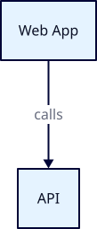
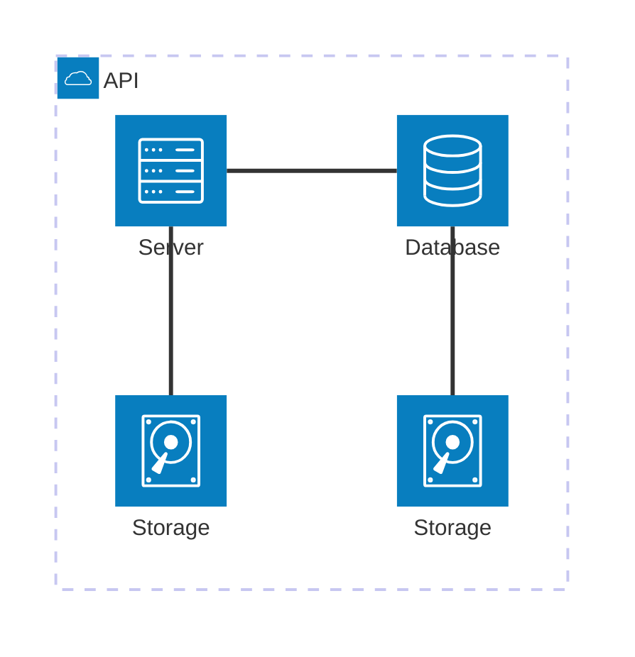

# 概要

## はじめに {#beginning}




```mermaid サンプル図/Mermaid
architecture-beta
    group api(cloud)[API]

    service db(database)[Database] in api
    service disk1(disk)[Storage] in api
    service disk2(disk)[Storage] in api
    service server(server)[Server] in api

    db:L -- R:server
    disk1:T -- B:server
    disk2:T -- B:db
```


D2からSVGへの変換方法：

```find docs/ -name "*.d2" -exec sh -c '~/.local/bin/d2 --theme 4 --pad 0 --scale 1 "$1" "${1%.d2}.svg"' _ {} \;```